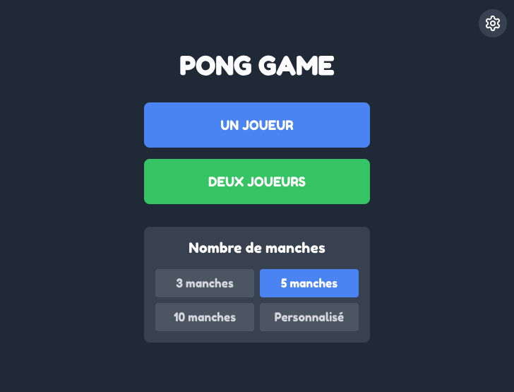
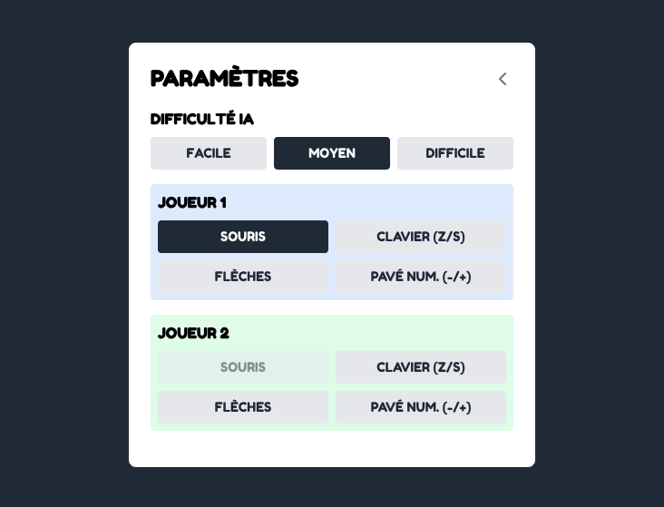
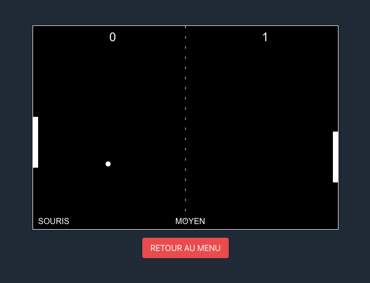
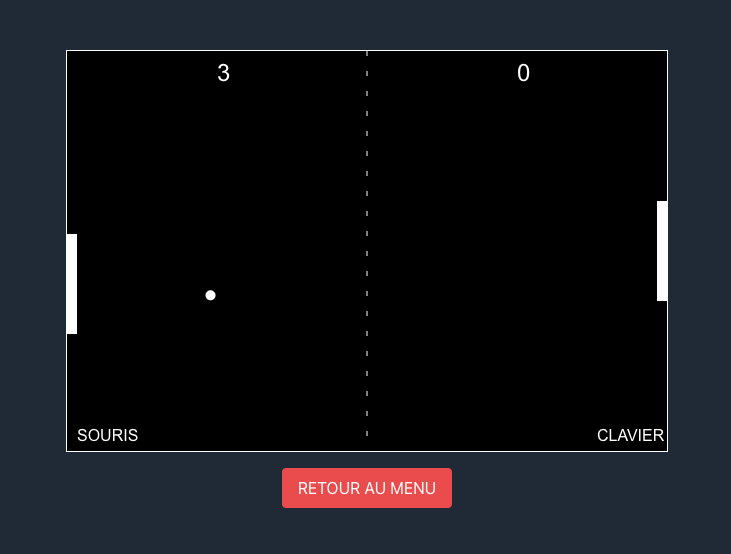

# 🏓 Pong Game

Ce projet est une implémentation moderne du jeu classique Pong, développé avec React et TypeScript.

## 📸 Captures d'écran

<table>
  <tr>
    <th>Menu Principal</th>
    <th>Paramètres</th>
    <th>Mode Solo</th>
    <th>Mode duo</th>
  </tr>
  <tr>
    <td></td>
    <td></td>
    <td></td>
    <td></td>
  </tr>
</table>

## 🛠 Technologies et Outils Utilisés

- React 18
- TypeScript
- CSS Modules
- HTML5 Canvas pour le rendu du jeu

## 🧩 Composants Principaux

1. `PongGame`: Composant principal qui gère l'état global du jeu.
2. `Menu`: Affiche le menu principal avec les options de jeu.
3. `SettingsMenu`: Permet aux joueurs de configurer les contrôles et la difficulté.
4. `GameBoard`: Gère la logique du jeu et le rendu du terrain de jeu.

## 🎮 Fonctionnement du Jeu

- Le jeu propose deux modes : Un joueur (contre l'IA) et Deux joueurs.
- Les joueurs contrôlent leurs raquettes pour frapper la balle.
- Le premier joueur à atteindre le score gagnant remporte la partie.

## 🕹️ Contrôles

- Les joueurs peuvent choisir entre :
  - Souris
  - Clavier (Z/S)
  - Flèches directionnelles
  - Pavé numérique (-/+)

## ⚙ Paramètres

- Nombre de manches gagnantes : 3, 5, 10 ou personnalisé
- Difficulté de l'IA : Facile, Moyen, Difficile

## 🤖 Gestion de l'IA

L'IA ajuste sa vitesse et sa réactivité en fonction du niveau de difficulté choisi :

- Facile : Mouvements lents et prédictibles
- Moyen : Vitesse et précision modérées
- Difficile : Mouvements rapides et anticipation accrue

L'IA utilise la position de la balle pour calculer ses mouvements, avec une marge d'erreur qui diminue avec l'augmentation de la difficulté.

## 🚀 Installation et Lancement

1. Clonez le repository
2. Installez les dépendances : `npm install`
3. Lancez le serveur de développement : `npm start`
4. Ouvrez [http://localhost:3000](http://localhost:3000) dans votre navigateur

## 🧪 Tests

Lancez les tests avec la commande : `npm test`

## 🏗 Build

Pour créer une version de production : `npm run build`

---

Développé par BEAUCHARD Nicolas
